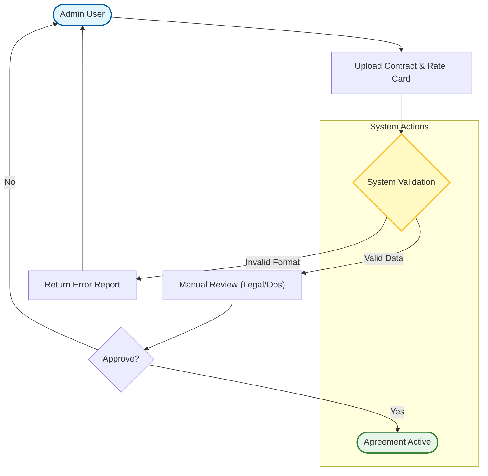

# Agreement Onboarding Flow (Admin)

Ensures all rates and legal terms are validated before use.

```mermaid
graph TD
    %% Nodes
    Admin(["Admin User"])
    Upload["Upload Contract & Rate Card"]
    SysVal{"System Validation"}
    Err["Return Error Report"]
    Review["Manual Review (Legal/Ops)"]
    Approve{"Approve?"}
    Live(["Agreement Active"])
    
    %% Styles
    style Admin fill:#e1f5fe,stroke:#01579b,stroke-width:2px
    style Live fill:#e8f5e9,stroke:#2e7d32,stroke-width:2px
    style SysVal fill:#fff9c4,stroke:#fbc02d,stroke-width:2px

    %% Flow
    Admin --> Upload
    Upload --> SysVal
    SysVal -- "Invalid Format" --> Err
    Err --> Admin
    SysVal -- "Valid Data" --> Review
    Review --> Approve
    Approve -- "No" --> Admin
    Approve -- "Yes" --> Live
    
    %% Subgraph
    subgraph System Actions
    SysVal
    Live
    end
```
