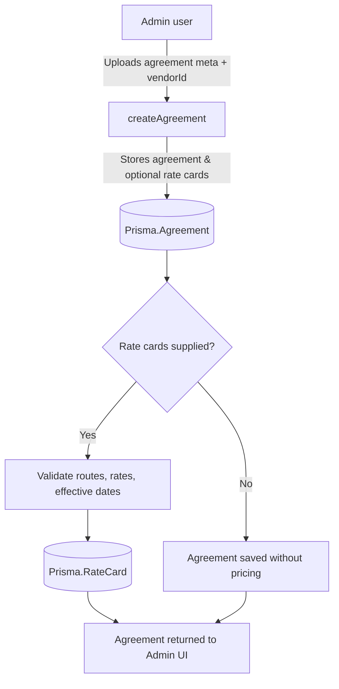
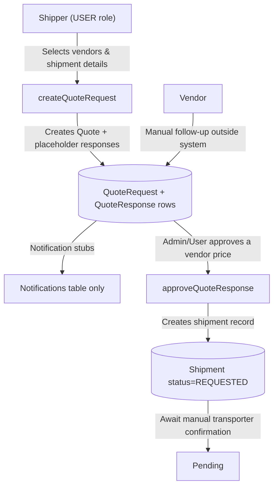
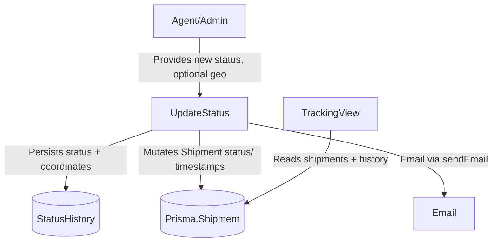

## Freight Management System – Workflow Analysis (Step 1)

This document captures the present-state workflows implemented in the Freight Management System codebase as of 22 Oct 2025. Each flow highlights system touchpoints, manual activities, and the primary data inputs/outputs. Use this as the baseline for validation before we implement the automation roadmap.

### 1. Agreement Lifecycle (Admin)

**Primary endpoints & modules**
- `POST /api/admin/agreements` → `adminController.createAgreement`
- `POST /api/admin/agreements/:id/rate-cards` → `adminController.addRateCard`
- `PUT /api/admin/agreements/:id` → `adminController.updateAgreement`

**Flow**


**Inputs**
- Vendor selection (`vendorId`)
- Agreement metadata: title, effectiveFrom/To, scope, payment terms, escalation contacts
- Optional rate cards array: origin, destination, vehicleType, ratePerKm, effectiveFrom

**Outputs**
- Persisted `Agreement` record (and `RateCard` rows when supplied)
- JSON response consumed by admin UI

**Manual interventions**
- Admin must prepare agreement data offline (legal review, rate compilation)
- No automated parsing of uploaded documents (`uploads/` directory unused)
- No reviewer workflow—approvals rely on ad-hoc admin judgement

### 2. Quotation Workflow (User ↔ Transporter)

**Primary endpoints & modules**
- `POST /api/quotes` → `quoteController.createQuoteRequest`
- `GET /api/quotes` → `quoteController.getQuoteRequests`
- `POST /api/quotes/responses/:responseId/approve` → `quoteController.approveQuoteResponse`

**Flow**


**Inputs**
- From/To location coordinates, weight, shipmentType, urgency, selected vendor IDs

**Outputs**
- `QuoteRequest` with autogenerated `QuoteResponse` placeholders (no price yet)
- Shipment record upon approval (status `REQUESTED`)

**Manual interventions & gaps**
- No API/UI for vendors to submit price/ETA (responses remain in `PENDING`)
- Notifications created in DB but no email/SMS dispatch
- Approval relies on admin/user checking responses externally

### 3. Booking Flow (Quote → Shipment Execution)

**Primary endpoints & modules**
- `POST /api/shipments` → `shipmentController.createShipment` (used mainly for direct bookings)
- `PUT /api/shipments/:id/status` → `shipmentController.updateShipmentStatus`
- Email templates in `services/emailService.js` (limited to shipment delivered / generic updates)

**Flow**
```mermaid
flowchart TD
    Start[Trigger: Quote approved or direct booking form] -->|Payload includes vendor, cost, ETA| Create[createShipment]
    Create -->|Generates trackingNumber + saves| Ship[(Shipment status=PENDING)]
    Ship -->|Sends basic email (if configured)| Email[SMTP dispatch]
    Ship --> StatusUpdate[Manual status changes via dashboard]
    StatusUpdate -->|Updates audit + status history| History[(StatusHistory table)]
    StatusUpdate -->|Optional email| Email
    StatusUpdate -->|Set DELIVERED triggers delivered email| Close[Shipment closed]
```

**Inputs**
- Booking payload must include vendor, cost, ETA (manually derived)
- No automatic consent capture or transporter acceptance endpoints

**Outputs**
- Shipment record with tracking number and audit log entries
- Status history rows per update

**Manual interventions & gaps**
- Transition from quote to confirmed booking needs manual approval and transporter coordination
- No SLA timers, expiry handling, or auto-reminders on pending quotes/bookings
- Notifications limited to email; SMS/push not implemented

### 4. Tracking Workflow

**Primary endpoints & modules**
- `GET /api/shipments/:id` / `GET /api/shipments/tracking/:trackingNumber`
- `PUT /api/shipments/:id/status` for updates with location lat/long

**Flow**


**Inputs**
- Manual status updates (status enum, notes, optional `latitude/longitude`, driver info)

**Outputs**
- Updated shipment rows, status history, audit log entry, email notification

**Manual interventions & gaps**
- No GPS integration or live telemetry; requires agent to enter updates
- No WebSocket/SSE for realtime front-end updates
- Predictive delay analytics absent

### 5. Invoicing & Financials

**Current state**
- No invoice/payment entities in Prisma schema
- Controllers/services lack payment gateway integrations
- No GST/TDS/TCS, RCM, or reconciliation logic present
- Email templates do not cover invoicing

**Manual process assumption**
- Finance handled entirely outside the system; shipment cost is informational only

---

### Summary of Manual Bottlenecks
- **Agreement intake**: No document parsing, approval sign-off, or digital signatures.
- **Quotation negotiations**: Vendors cannot submit quotes within the platform; users must coordinate offline.
- **Booking confirmations**: Transporter acceptance, consent records, and notification cascades are manual.
- **Tracking**: Location and status updates hinge on human intervention.
- **Financial compliance**: All taxation, invoicing, and payment workflows are absent.

### Next Steps
1. Review this mapping with business stakeholders to validate current vs. desired flows.
2. Prioritize automation scope per the 13-step directive once sign-off is received.

